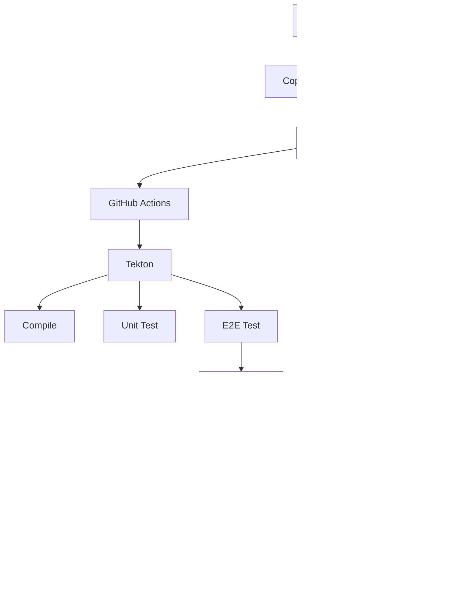

# ai-just-project

AI Just Project 是一個 **AI 驅動開發平台架構規劃**。

## 核心架構

```mermaid
flowchart TD
A[Developer] --> B[Copilot CLI / Codex CLI]
B --> C[Git Push]
C --> D[GitHub Actions]
D --> E[Tekton]
E --> F[Compile]
E --> G[Unit Test]
E --> H[E2E Test]
H --> I[Test Report]
I --> J[Aider Bug Fix]
J --> K[OpenRouter]
K --> L[DeepSeek Coder]
K --> M[Qwen Coder]
L --> C
M --> C
```
