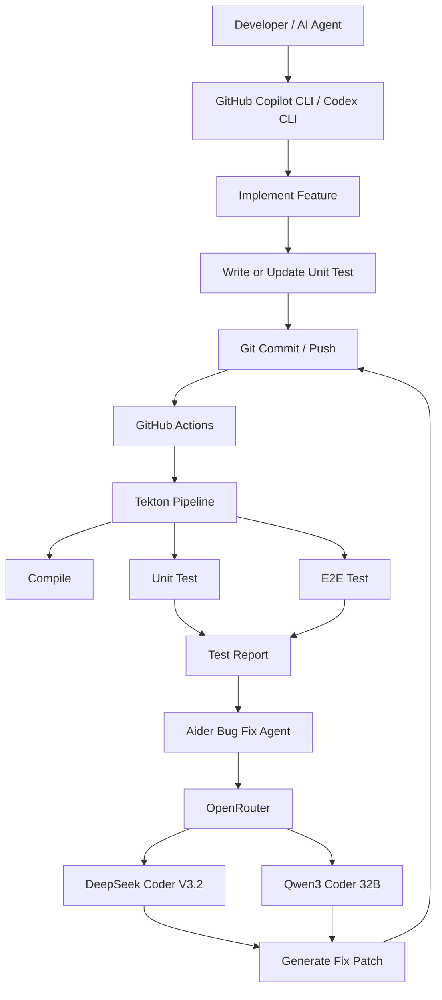
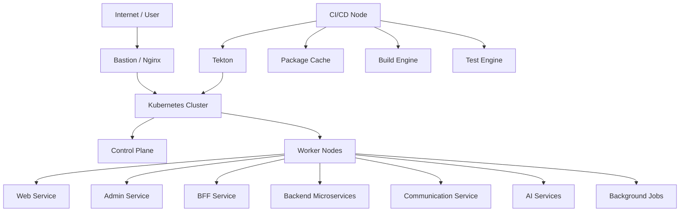
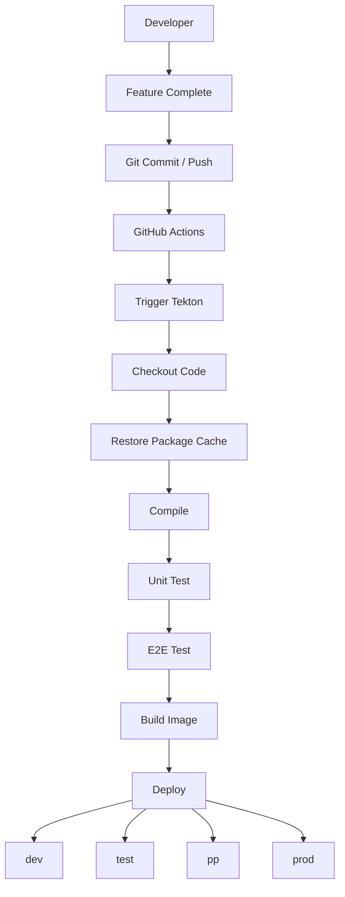

# ai-just-project

AI Just Project 是一個以 **AI 驅動開發流程**、**Kubernetes 微服務架構**、**E2E 驗證**、**通訊協作**、**災難復原** 為核心的系統平台規劃文件 repo。

## 核心目標

- 建立 AI 輔助開發平台
- 建立可獨立部署與動態更新的微服務架構
- 以 GitHub Actions → Tekton 建立標準化 CI/CD
- 以 E2E 作為功能完成與交付的主要驗收方式
- 以 Aider + OpenRouter 建立 AI Bug Fix 流程
- 整合 Telegram / Discord / LINE / fastIM
- 建立基礎 DR / 備份回存 / K8s 還原 / 多地部署規劃
- 進一步延伸到功能設計、頁面設計、操作流程設計

## 1. AI 開發平台架構



## 2. Kubernetes 部署架構



## 3. CI/CD Pipeline 架構



## 4. 功能模組總覽

- 使用者管理
- 角色與權限管理
- 專案管理
- 任務管理
- AI 開發管理
- 測試管理
- 部署管理
- 微服務管理
- 通訊與通知管理
- 報表管理
- 災難復原管理
- 系統設定

## 5. 主要頁面總覽

- Dashboard
- User Management
- Role Permission
- Project Management
- Task Management
- AI Development
- Testing Management
- Deployment Management
- Microservice Management
- Communication Management
- Disaster Recovery Management
- System Settings

## 6. 文件目錄

```text
docs/
├─ 00-overview
├─ 01-product-design
├─ 02-system-architecture
├─ 03-ai-development-platform
├─ 04-development-workflow
├─ 05-frontend
├─ 06-backend
├─ 07-data-architecture
├─ 08-devops
├─ 09-ai-model-deployment
├─ 10-security
├─ 11-testing
├─ 12-operations
├─ 13-roadmap
├─ 14-communication-collaboration
├─ 15-disaster-recovery
├─ 16-functional-specifications
├─ 17-page-design
└─ 18-workflow-design
```

## 7. 版本

- v0.2.1：全量文件更新，重新整理架構、功能規格、頁面設計與工作流程
