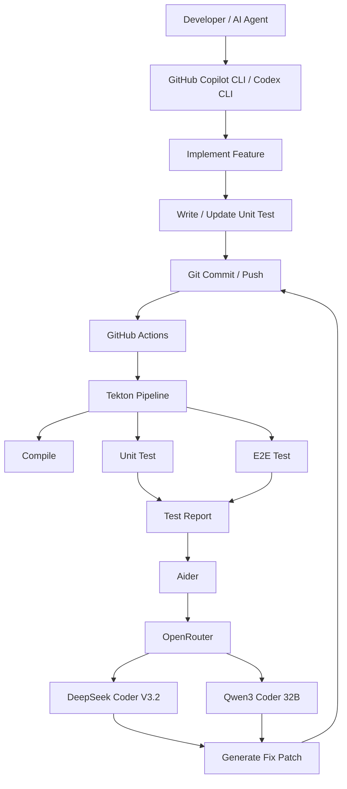

# AI Development Platform Architecture

```mermaid
flowchart TD
    A[Developer / AI Agent] --> B[GitHub Copilot CLI / Codex CLI]
    B --> C[Implement Feature]
    C --> D[Write / Update Unit Test]
    D --> E[Git Commit / Push]
    E --> F[GitHub Actions]
    F --> G[Tekton Pipeline]
    G --> H[Compile]
    G --> I[Unit Test]
    G --> J[E2E Test]
    I --> K[Test Report]
    J --> K
    K --> L[Aider]
    L --> M[OpenRouter]
    M --> N[DeepSeek Coder V3.2]
    M --> O[Qwen3 Coder 32B]
    N --> P[Generate Fix Patch]
    O --> P
    P --> E
```

## 說明

- 主要開發工具：GitHub Copilot CLI、Codex CLI
- 開發事件觸發：GitHub Actions
- 編譯與測試執行：Tekton
- AI 修錯：Aider + OpenRouter + 指定 Coding Models
- 驗證主軸：E2E Test
