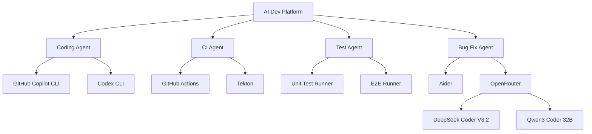

# Auto Dev Agent Architecture

```mermaid
flowchart TD
    A[AI Dev Platform] --> B[Coding Agent]
    A --> C[CI Agent]
    A --> D[Test Agent]
    A --> E[Bug Fix Agent]

    B --> B1[GitHub Copilot CLI]
    B --> B2[Codex CLI]

    C --> C1[GitHub Actions]
    C --> C2[Tekton]

    D --> D1[Unit Test Runner]
    D --> D2[E2E Runner]

    E --> E1[Aider]
    E --> E2[OpenRouter]
    E2 --> E3[DeepSeek Coder V3.2]
    E2 --> E4[Qwen3 Coder 32B]
```

## 後續可擴充

- AI Architect Agent
- AI DevOps Agent
- AI Test Generator
- AI Refactor Agent
