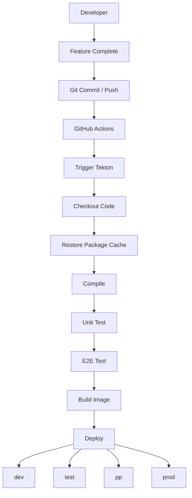

# CI/CD Pipeline Architecture

```mermaid
flowchart TD
    A[Developer] --> B[Feature Complete]
    B --> C[Git Commit / Push]
    C --> D[GitHub Actions]
    D --> E[Trigger Tekton]
    E --> F[Checkout Code]
    F --> G[Restore Package Cache]
    G --> H[Compile]
    H --> I[Unit Test]
    I --> J[E2E Test]
    J --> K[Build Image]
    K --> L[Deploy]
    L --> M[dev]
    L --> N[test]
    L --> O[pp]
    L --> P[prod]
```

## 說明

- GitHub Actions 主要作為開發觸發層
- Tekton 為實際建置、測試、部署執行層
- Package Cache 整合於專用 CI/CD Node 內
