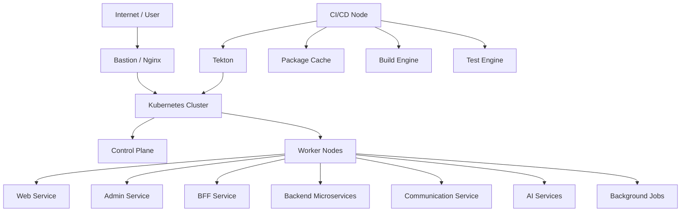

# Kubernetes Deployment Architecture

```mermaid
flowchart TD
    A[Internet / User] --> B[Bastion / Nginx]
    B --> C[Kubernetes Cluster]
    C --> D[Control Plane]
    C --> E[Worker Nodes]

    E --> F[Web Service]
    E --> G[Admin Service]
    E --> H[BFF Service]
    E --> I[Backend Microservices]
    E --> J[Communication Service]
    E --> K[AI Services]
    E --> L[Background Jobs]

    M[CI/CD Node] --> N[Tekton]
    M --> O[Package Cache]
    M --> P[Build Engine]
    M --> Q[Test Engine]
    N --> C
```

## 說明

- 既有環境包含 Control Plane、Worker Nodes、Bastion / Nginx
- 專用 CI/CD Node 內含 Tekton 與 Package Cache
- Worker Nodes 承載前端、後端、通訊、AI 與背景任務
