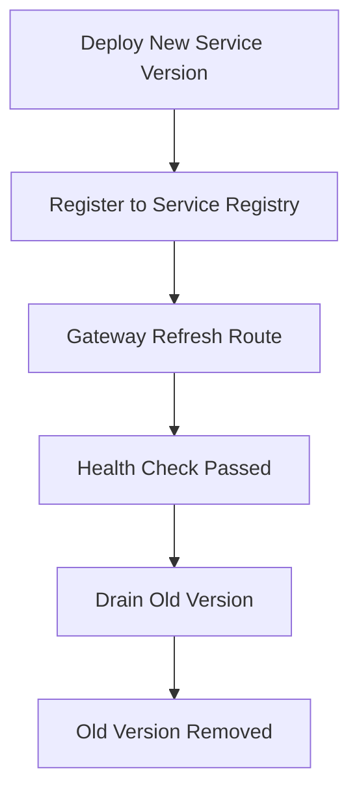

# Microservice Update Strategy

核心原則：
- 單服務更新
- 不需重新部署全部 API
- 支援動態註冊
- 支援版本切換
- 支援 Rolling Update

## 流程

```mermaid
flowchart TD
    A[Deploy New Service Version] --> B[Register to Service Registry]
    B --> C[Gateway Refresh Route]
    C --> D[Health Check Passed]
    D --> E[Drain Old Version]
    E --> F[Old Version Removed]
```

## Kubernetes 策略

- RollingUpdate
- maxUnavailable: 0
- maxSurge: 1
